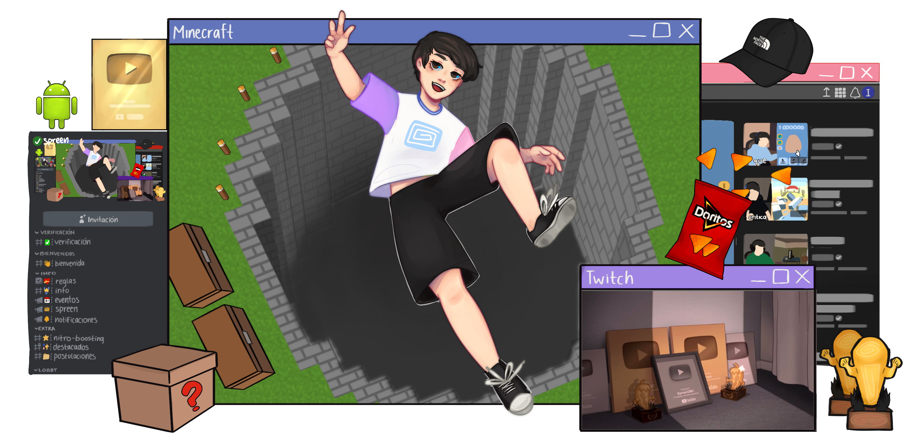

## Hola! 👋

Somos una organización de desarrolladores que trabajan juntos para crear y dar soporte a proyectos principalmente relacionados con el [Discord de Spreen](https://discord.com/invite/spreen). Nuestro objetivo como equipo es dar una mejor experiencia a toda la comunidad e innovar en las funciones que tienen generalmente los bots de Discord.

### Lenguajes y herramientas que utilizamos

### Contáctanos

